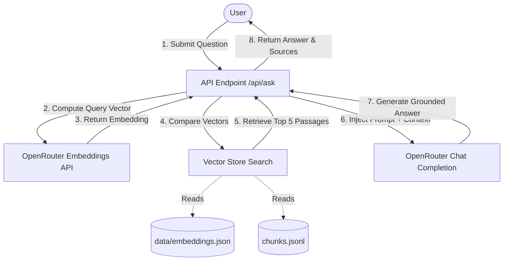

# ActiveGuide AI — RAG-Powered Physical Activity Guidelines Assistant

ActiveGuide AI is an intelligent Retrieval-Augmented Generation (RAG) assistant designed to provide accurate, evidence-based answers to questions about the **Physical Activity Guidelines for Americans (2nd Edition, 2018)**, published by the U.S. Department of Health and Human Services.

The application leverages a lightweight custom in-memory vector database and advanced Language Models (LLMs) via the OpenRouter API to deliver answers with precise source page citations.

---

## 🚀 Key Features

- **Strictly Grounded RAG Flow**: The assistant answers questions *only* using retrieved passages from the official guidelines to eliminate AI hallucinations.
- **Source Citations**: Every generated answer is anchored to source PDF pages (e.g., `[Page 24]`), and includes an expandable sources drawer showing the matched text and similarity score.
- **Custom In-Memory Vector Search**: Uses vector embeddings and a custom Cosine Similarity calculation to search and rank the most relevant guidelines passages.
- **Ingestion Pipeline**: A pre-computation script that chunks text data, calls OpenRouter to generate embeddings, and caches them locally to ensure fast queries.
- **Premium User Interface**: Elegant welcome screen with quick-start question chips, real-time typing indicators, glassmorphism design accents, and fully responsive layouts.

---

## 🏗️ System Architecture

ActiveGuide AI implements a classic RAG (Retrieval-Augmented Generation) pipeline:



1. **Ingestion & Caching (Run Once)**:
   - Extracted document text chunks are loaded from `chunks.jsonl`.
   - Each chunk's text is sent to the OpenRouter Embeddings API (`baai/bge-base-en-v1.5` by default) to generate a high-dimensional vector.
   - The computed vector embeddings are cached locally in `data/embeddings.json`.

2. **Query Retrieval & Generation**:
   - The user enters a question.
   - The app computes the query's vector embedding via OpenRouter.
   - The search engine calculates the **Cosine Similarity** between the query embedding and the cached embeddings, returning the top-5 most similar text passages.
   - The top passages are formatted into a context block and injected into a strict grounding prompt.
   - The prompt is sent to `google/gemini-2.0-flash-001` via OpenRouter to generate a markdown-formatted response with page citations.

---

## 📁 File Structure

```
├── app/
│   ├── api/
│   │   └── ask/
│   │       └── route.js       # RAG API endpoint (Embed Query -> Vector Search -> Prompt -> Completion)
│   ├── globals.css            # Custom CSS styling (Layout, typography, animations, dark mode)
│   ├── layout.js              # Next.js Root Layout
│   └── page.js                # Frontend page UI (Welcome screen, chat flow, input handling)
├── components/
│   ├── ChatMessage.jsx        # Chat bubble message component with Markdown renderer
│   ├── SourceCard.jsx         # Expandable sources and page match percentages drawer
│   └── SuggestedQuestions.jsx # Quick starter suggestion chips
├── data/
│   └── embeddings.json        # Pre-computed chunk embeddings cache (created via ingest script)
├── lib/
│   ├── openrouter.js          # API client helper for OpenRouter Embeddings and Chat
│   └── vectorStore.js         # Custom Cosine Similarity search engine for memory-loaded chunks
├── scripts/
│   └── ingest.mjs             # Ingestion CLI script for caching embeddings
├── .env.local                 # Local environment variables config (API keys & models)
├── .gitignore                 # Git ignore config (Excludes node_modules, build caches, credentials)
├── chunks.jsonl               # Official guideline text chunks with source page metadata
├── config.json                # Project config (default embedding model configuration)
├── package.json               # Next.js dependencies, scripts, and commands
└── README.md                  # Project documentation (this file)
```

---

## 💻 Local Setup & Installation

Follow these steps to run the project locally on your machine.

### Prerequisites
- [Node.js](https://nodejs.org/) (v18.x or higher)
- [npm](https://www.npmjs.com/) (installed with Node)
- An [OpenRouter API Key](https://openrouter.ai/)

### Step 1: Clone the Repository
```bash
git clone https://github.com/rasel1510/RAG-For-Physical-Activity-Guidline.git
cd RAG-For-Physical-Activity-Guidline
```

### Step 2: Install Dependencies
Install all package dependencies:
```bash
npm install
```

### Step 3: Configure Environment Variables
Create a file named `.env.local` in the project root:
```env
OPENROUTER_API_KEY=your_openrouter_api_key_here

# Optional: Override default models if desired
# EMBEDDING_MODEL=baai/bge-base-en-v1.5
# CHAT_MODEL=google/gemini-2.0-flash-001
```

### Step 4: Run the Ingestion Pipeline
Compute embeddings for all guideline chunks and cache them locally (this might take a minute and uses OpenRouter API credits):
```bash
npm run ingest
```
*Note: Make sure your `.env.local` contains a valid API key before running.*

### Step 5: Start the Development Server
Launch the Next.js local server:
```bash
npm run dev
```

The application will be running at **`http://localhost:3000`**. Open this URL in your web browser to start chatting with ActiveGuide AI!

---

## 🛠️ Built With

- **Framework**: [Next.js 15](https://nextjs.org/) (App Router)
- **UI & Logic**: [React 19](https://react.dev/), Vanilla CSS
- **AI Models**: 
  - Chat Model: `google/gemini-2.0-flash-001` via [OpenRouter](https://openrouter.ai/)
  - Embedding Model: `baai/bge-base-en-v1.5` via [OpenRouter](https://openrouter.ai/)
- **Markdown Rendering**: [react-markdown](https://github.com/remarkjs/react-markdown)
