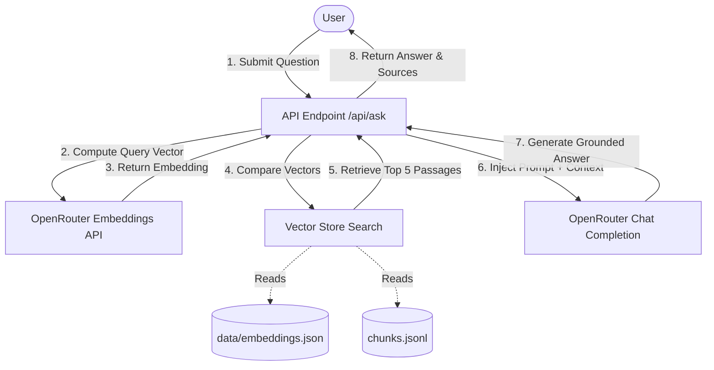

# ActiveGuide AI — RAG-Powered Physical Activity Guidelines Assistant

ActiveGuide AI is an intelligent Retrieval-Augmented Generation (RAG) assistant designed to provide accurate, evidence-based answers to questions about the **Physical Activity Guidelines for Americans (2nd Edition, 2018)**, published by the U.S. Department of Health and Human Services.

The application leverages a lightweight custom in-memory vector database and advanced Language Models (LLMs) via the OpenRouter API to deliver answers with precise source page citations.

---

## 🚀 Key Features

- **Strictly Grounded RAG Flow**: The assistant answers questions *only* using retrieved passages from official guidelines to eliminate AI hallucinations.
- **Source Citations**: Every generated answer is anchored to source PDF pages (e.g., `[Page 24]`), and includes an expandable sources drawer showing matched text snippets and similarity match scores.
- **Custom In-Memory Vector Search**: Uses vector embeddings and high-performance Cosine Similarity calculation to search and rank the most relevant guideline passages.
- **Ingestion Pipeline**: Pre-computation CLI script that reads document text chunks, generates vector embeddings via OpenRouter, and caches them locally for ultra-fast query execution.
- **Premium User Interface**: Modern UI with quick-start question chips, real-time typing indicators, glassmorphism visual styling, markdown support, and mobile responsiveness.

---

## 🏗️ System Architecture

ActiveGuide AI implements a classic Retrieval-Augmented Generation pipeline:


```mermaid
graph TD
    %% User Query & Search
    User([User]) -->|1. Submit Question| API[API Endpoint /api/ask]
    API -->|2. Compute Query Vector| OpenRouterEmbed[OpenRouter Embeddings API]
    OpenRouterEmbed -->|3. Return Embedding| API
    
    %% Vector Retrieval
    API -->|4. Compare Vectors| VectorStore[Vector Store Search]
    VectorStore -.->|Reads| EmbedCache[(data/embeddings.json)]
    VectorStore -.->|Reads| ChunksCache[(chunks.jsonl)]
    VectorStore -->|5. Retrieve Top 5 Passages| API
    
    %% LLM Generation
    API -->|6. Inject Prompt + Context| OpenRouterLLM[OpenRouter Chat Completion]
    OpenRouterLLM -->|7. Generate Grounded Answer| API
    API -->|8. Return Answer & Sources| User
```

1. **Ingestion & Caching (Pre-run)**:
   - Extracted document text chunks are loaded from `chunks.jsonl`.
   - Each chunk's text is sent to the OpenRouter Embeddings API (`baai/bge-base-en-v1.5` by default) to generate a 768-dimensional vector.
   - The computed vector embeddings are cached locally in `data/embeddings.json`.

2. **Query Retrieval & Generation**:
   - The user submits a question in the chat interface.
   - The application computes the question's vector embedding via OpenRouter.
   - The search engine computes **Cosine Similarity** between the query embedding and all cached embeddings, selecting the top 5 most relevant passages.
   - The top passages are formatted into context and passed to `google/gemini-2.0-flash-001` (or your configured model) via OpenRouter.
   - The LLM streams/generates a response formatted in Markdown with source page numbers.

---

## 📦 Packages & Dependencies

This project relies on the following core dependencies:

| Package | Version | Purpose |
| :--- | :--- | :--- |
| **`next`** | `^15.3.0` | React framework for Server-Side Rendering (SSR) & API routes |
| **`react`** | `^19.0.0` | Core UI component library |
| **`react-dom`** | `^19.0.0` | DOM renderer for React components |
| **`react-markdown`** | `^9.0.0` | Markdown parser for rendering structured AI chat responses |

---

## 💻 Local Setup & Run Guide (Windows & macOS)

Follow these step-by-step instructions to set up and run the project on your local computer.

### 📋 Prerequisites

Before starting, ensure you have the following installed on your machine:

1. **Node.js** (v18.0.0 or higher recommended)
   - Check if installed: `node -v`
   - Download: [Node.js Official Website](https://nodejs.org/) (LTS version recommended)
2. **Git**
   - Check if installed: `git --version`
   - Download: [git-scm.com](https://git-scm.com/)
3. **OpenRouter API Key**
   - Sign up for a free account at [OpenRouter.ai](https://openrouter.ai/)
   - Create an API Key at [openrouter.ai/keys](https://openrouter.ai/keys)

---

### Step 1: Clone the Repository

Open your terminal (macOS/Linux) or Command Prompt / PowerShell / Git Bash (Windows) and clone the repository:

```bash
git clone https://github.com/rasel1510/RAG-For-Physical-Activity-Guidline.git
cd RAG-For-Physical-Activity-Guidline
```

---

### Step 2: Install Project Packages & Dependencies

Run the installation command to download all required packages specified in `package.json`:

```bash
npm install
```
*(Alternatively, if using Yarn or pnpm: `yarn install` or `pnpm install`)*

---

### Step 3: Configure Environment Variables

The project requires an OpenRouter API key to generate embeddings and run AI responses.

#### **On macOS / Linux (Terminal):**
```bash
cp .env.example .env.local
```
Then open `.env.local` in your editor (e.g., `nano .env.local` or VS Code `code .env.local`) and paste your API key.

#### **On Windows (PowerShell):**
```powershell
Copy-Item .env.example .env.local
```

#### **On Windows (Command Prompt - CMD):**
```cmd
copy .env.example .env.local
```

#### **Configure `.env.local` contents:**
Ensure your `.env.local` file contains:
```env
OPENROUTER_API_KEY=your_actual_openrouter_api_key_here

# Optional: Override default models if desired
EMBEDDING_MODEL=baai/bge-base-en-v1.5
CHAT_MODEL=google/gemini-2.0-flash-001
```

---

### Step 4: Run the Embedding Ingestion Script

Generate vector embeddings for all document text chunks and cache them locally in `data/embeddings.json`:

```bash
npm run ingest
```

> **Note**: This process takes about 30–60 seconds as it batches text chunks through the OpenRouter Embeddings API. Make sure your `.env.local` has a valid `OPENROUTER_API_KEY` before running this step.

---

### Step 5: Start the Local Development Server

Launch the Next.js development server:

```bash
npm run dev
```

You will see output similar to:
```text
  ▲ Next.js 15.3.0
  - Local:        http://localhost:3000
  - Network:      http://192.168.x.x:3000

 ✓ Starting...
 ✓ Ready in 1.8s
```

---

### Step 6: Open the Application in Your Browser

Open your web browser (Chrome, Edge, Safari, Firefox) and navigate to:

👉 **`http://localhost:3000`**

You can now ask questions about physical activity guidelines and view retrieved source citations in real time!

---

## 📜 Available Commands & Scripts Reference

| Command | Description |
| :--- | :--- |
| `npm run dev` | Starts the Next.js development server at `http://localhost:3000` |
| `npm run ingest` | Runs `scripts/ingest.mjs` to fetch and cache vector embeddings |
| `npm run build` | Builds an optimized production bundle in `.next/` |
| `npm run start` | Starts the production server (run `npm run build` first) |

---

## 📁 Project Directory Structure

```
├── app/
│   ├── api/
│   │   └── ask/
│   │       └── route.js       # RAG API endpoint (Embed Query -> Vector Search -> Prompt -> Completion)
│   ├── globals.css            # Custom CSS styling (Layout, typography, glassmorphism theme)
│   ├── layout.js              # Next.js Root Layout
│   └── page.js                # Main chat interface component
├── components/
│   ├── ChatMessage.jsx        # Message bubble renderer with Markdown formatting
│   ├── SourceCard.jsx         # Expandable sources and page match percentage drawer
│   └── SuggestedQuestions.jsx # Quick starter prompt buttons
├── data/
│   └── embeddings.json        # Pre-computed chunk vector embeddings cache
├── lib/
│   ├── openrouter.js          # OpenRouter API client for embeddings & chat completions
│   └── vectorStore.js         # In-memory Cosine Similarity vector search engine
├── scripts/
│   └── ingest.mjs             # CLI ingestion script to embed document chunks
├── .env.example               # Template for environment configuration
├── .env.local                 # Local secret environment variables (Git ignored)
├── chunks.jsonl               # Guideline text chunks with page number metadata
├── config.json                # Project configuration file
├── package.json               # Node.js dependencies and script definitions
└── README.md                  # Project documentation
```

---

## ❓ Troubleshooting & FAQs

### 1. `OPENROUTER_API_KEY not set in .env.local`
- **Cause**: The `.env.local` file is missing or `OPENROUTER_API_KEY` is not defined inside it.
- **Fix**: Make sure `.env.local` exists in the project root directory and contains `OPENROUTER_API_KEY=sk-or-v1-...`.

### 2. `data/embeddings.json not found`
- **Cause**: The ingestion step was skipped.
- **Fix**: Run `npm run ingest` to generate and save the embeddings file before starting `npm run dev`.

### 3. Port 3000 is already in use
- **Cause**: Another service or dev server is using port `3000`.
- **Fix**: Next.js will automatically prompt to run on `http://localhost:3001`. Press `Y` or stop the other process.

### 4. `Node version not supported`
- **Cause**: Node.js version is older than `v18.0.0`.
- **Fix**: Upgrade Node.js to version `18.x` or `20.x` LTS from [nodejs.org](https://nodejs.org/).

---

## 🛠️ Built With

- **Framework**: [Next.js 15](https://nextjs.org/) (App Router)
- **UI Libraries**: [React 19](https://react.dev/), Vanilla CSS
- **AI Models**:
  - Chat Completion: `google/gemini-2.0-flash-001` via [OpenRouter](https://openrouter.ai/)
  - Embeddings: `baai/bge-base-en-v1.5` via [OpenRouter](https://openrouter.ai/)
- **Markdown Renderer**: [react-markdown](https://github.com/remarkjs/react-markdown)

---

## 📄 License

This project is open-source and available under the [MIT License](LICENSE).
